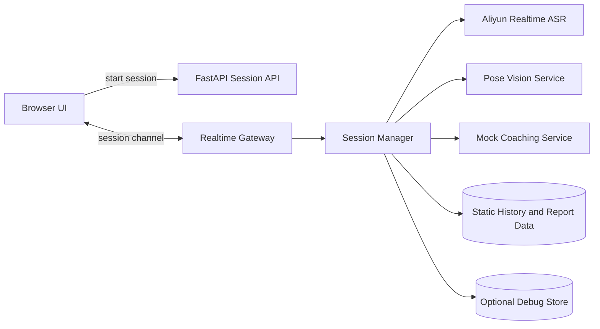

# Speak Up

Speak Up 是一个 AI 演讲训练产品原型，当前重点是把一次训练的核心链路跑通：

- 训练前选择场景和语言
- 训练中采集麦克风和视频帧
- 实时拿到语音转写结果
- 训练后查看报告和回放
- 需要时打开 debug dump，保留排障证据

这版不是完整生产系统，但已经不是纯 mock Demo。当前仓库是“真实实时转写 + 姿态识别 V1 + mock 报告与历史 + 可用 debug/replay”的混合形态。

## 当前状态

### 已经是真实能力的部分

- 浏览器麦克风采集
- 浏览器摄像头预览
- `POST /api/session/start` + `WS /ws/session/:session_id`
- 前端实时 `PCM 16k mono` 音频上行
- 后端接入阿里云 `qwen3-asr-flash-realtime`
- 实时 `transcript_partial` / `transcript_final`
- transcript 时间轴回放
- debug 开关
- debug 模式下的完整录音 `session_full.webm`

### 仍然是 mock 或静态数据的部分

- 报告分数、建议和趋势
- 历史记录列表
- 视频理解的大模型层
- 语音播报
- 数据持久化

### 当前已经接入但仍然偏规则化的部分

- 基于本地骨架点的姿态识别
- 基于姿态信号的实时 `live_insight`

## 当前支持的功能

### 训练场景

当前内置 3 个场景：

- `host`：主持人场景
- `guest-sharing`：嘉宾分享场景
- `standup`：脱口秀场景

每个场景都支持：

- `zh`
- `en`

### 训练页

训练页当前支持：

- 摄像头预览
- 麦克风权限请求
- 实时会话创建
- WebSocket 长连接
- 实时文字稿
- 实时分析面板
- 历史记录侧边栏
- `开始 / 暂停 / 重置 / 结束并生成报告`

### 实时转写

当前实时转写已经接入阿里云实时 ASR：

- 前端通过 `AudioWorklet` 采集麦克风音频
- 音频被重采样到 `PCM 16k mono`
- 以约 `100ms` 一包发送给后端
- 后端把音频转发给阿里云 `qwen3-asr-flash-realtime`
- 阿里云返回 partial / final
- 前端展示实时字幕和最终文字稿

当前断句主要依赖阿里云 `server_vad`。另外，后端只保留一条很窄的补偿规则：如果 final 结果只是 `嗯 / 哦 / 诶` 这种语气词尾巴，会并回上一句，不单独起一条 transcript。

### 回放与 debug

训练结束后，报告页可以进入 replay 页面，展示：

- transcript 时间轴
- debug 音频回放

### 姿态识别

当前姿态识别走的是“前端小模型 + 后端规则聚合”：

- 前端使用 `MediaPipe Pose Landmarker`
- 模型资源从本地 `public/mediapipe/wasm` 和 `public/models/pose_landmarker_lite.task` 加载
- 前端高频跟踪姿态关键点
- 前端低频发送 `pose_snapshot`
- 后端根据姿态信号生成实时 posture insight

V1 当前重点识别：

- 是否在镜头中心
- 是否离镜
- 上身或身体是否歪斜
- 上身或身体是否晃动
- 手势是否偏少

当前姿态 V1 明确区分两类镜头模式：

- `full-body`：肩膀和髋部都较稳定进入画面，更接近站立全身表达
- `upper-body`：主要看到头肩区域，更接近桌前近景或坐姿演讲

在 `upper-body` 模式下：

- 系统不会因为看不到髋部就直接判为异常
- 姿态提示会更偏头肩区域，而不是笼统写成“站姿”

### Pose Debug

训练页顶部有单独的 `Pose Debug` 开关，默认关闭。

打开后：

- 左侧相机区会显示本地 `Pose Debug · Local`
- 右侧 `AI Live Coach` 会显示后端 `Pose Debug · Server`

这两个面板分别用于定位：

- 本地骨架点是否正常
- 后端最近 3 秒窗口里命中了哪条姿态规则

常用字段解释：

- `body present`：当前是否已经进入“可判断姿态”的状态
- `shoulder visible / hip visible`：肩膀和髋部关键点是否稳定可见
- `camera mode`：当前是 `upper-body` 还是 `full-body`
- `body scale`：人体在画面中的相对尺度，越大说明离镜头越近
- `center offset`：人体中心相对画面中心的偏移
- `shoulder tilt / torso tilt`：肩线和躯干相对理想姿态的偏斜角
- `gesture / stability`：手势活跃度和近几秒稳定性
- `selected rule`：后端当前命中的姿态规则
- `close-up mode`：后端是否认定为桌前近景模式

训练页顶部有 `Debug Dump` 开关，默认关闭。

关闭时：

- 麦克风仍然会正常请求
- 实时 ASR 仍然正常工作
- 视频帧仍然正常上行
- 后端不写 debug 文件

打开时：

- 后端会创建 `backend/debug/<session_id>/`
- 保存事件日志、音频 chunk、视频帧
- 在暂停或结束时保存完整可播放录音

debug 目录结构当前大致如下：

```text
backend/debug/<session_id>/
  metadata.json
  events.jsonl
  audio/
    audio_0001.pcm
    audio_0002.pcm
    ...
    session_full.webm
  frames/
    frame_0001.jpg
    frame_0002.jpg
    ...
```

说明：

- `audio_000x.pcm` 是实时 ASR 主链路的原始 PCM chunk
- `session_full.webm` 是浏览器可直接回放的完整录音
- 当前 replay 页优先播放 `session_full.webm`

## 本地运行

### 环境要求

- Node.js 20+
- npm
- Python 3.11+

### 前端

```bash
npm install
cp .env.example .env.local
npm run dev
```

默认地址：

```text
http://localhost:3000
```

前端环境变量：

```bash
NEXT_PUBLIC_API_BASE_URL=http://127.0.0.1:8000
```

### 后端

首次启动：

```bash
python3 -m venv backend/.venv
source backend/.venv/bin/activate
pip install -r backend/requirements.txt
uvicorn app.main:app --reload --app-dir backend --port 8000
```

默认地址：

```text
http://127.0.0.1:8000
```

健康检查：

```bash
curl http://127.0.0.1:8000/health
```

### 阿里云实时 ASR 配置

后端通过环境变量读取阿里云配置：

```bash
export DASHSCOPE_API_KEY='sk-你的key'
export ALIYUN_REALTIME_ASR_MODEL='qwen3-asr-flash-realtime'
export ALIYUN_REALTIME_ASR_URL='wss://dashscope.aliyuncs.com/api-ws/v1/realtime'
export ALIYUN_REALTIME_ASR_VAD_THRESHOLD='0.0'
export ALIYUN_REALTIME_ASR_SILENCE_DURATION_MS='1200'
```

如果你修改了这些变量，必须重启后端进程。

## 使用方式

### 常规训练

1. 启动前后端
2. 打开 `http://localhost:3000`
3. 选择场景和语言
4. 保持 `Debug Dump` 关闭
5. 点击开始
6. 允许浏览器访问麦克风和摄像头
7. 观察实时文字稿
8. 点击暂停、重置或结束并生成报告

### Debug 训练

1. 开始前打开 `Debug Dump`
2. 进行一次训练
3. 暂停或结束
4. 到 `backend/debug/<session_id>/` 查看证据
5. 如果需要回放，优先使用 `session_full.webm`

## 项目结构

```text
.
├── src/
│   ├── app/
│   │   ├── page.tsx
│   │   ├── report/page.tsx
│   │   └── session/
│   │       ├── page.tsx
│   │       └── [sessionId]/replay/page.tsx
│   ├── components/
│   │   ├── report/
│   │   ├── session/
│   │   └── ui/
│   ├── hooks/
│   │   └── useMockSession.ts
│   ├── lib/
│   │   └── api.ts
│   └── types/
│       ├── report.ts
│       └── session.ts
├── public/
│   ├── audio/pcm-capture.worklet.js
│   ├── mediapipe/
│   └── models/
├── backend/
│   ├── app/
│   │   ├── data/
│   │   ├── services/
│   │   │   ├── coaching_service.py
│   │   │   ├── debug_store.py
│   │   │   ├── session_manager.py
│   │   │   ├── stt_service.py
│   │   │   └── vision_service.py
│   │   ├── main.py
│   │   └── schemas.py
│   ├── REALTIME_ARCHITECTURE.md
│   └── requirements.txt
├── .env.example
├── AGENTS.md
└── README.md
```

说明：

- `useMockSession.ts` 名字还保留着历史命名，但内部已经不是纯 mock hook
- `stt_service.py` 当前是真实阿里云 ASR adapter
- `vision_service.py` 当前已经接入姿态规则聚合和近景模式判断
- `coaching_service.py` 当前只负责包装 `live_insight` 事件

## 系统架构

### 高层结构



### 核心数据流

1. 前端通过 REST 创建 session。
2. 前端建立 WebSocket，并发送 `start_stream`。
3. 前端开始采集麦克风 PCM 音频并上行 `audio_chunk`。
4. 后端 `SessionManager` 把 chunk 转发到阿里云实时 ASR。
5. 阿里云返回 partial / final transcript。
6. 后端把结果映射为 `transcript_partial` / `transcript_final` 回推给前端。
7. 前端更新实时文字稿和最终 transcript 列表。
8. 如果打开 debug，浏览器同时保留完整 WebM 录音，并在暂停或结束时上传给后端。

### 双音频链路

当前音频被拆成两条链路：

- 主链路：`PCM 16k mono`，只用于实时 ASR
- debug 链路：`MediaRecorder -> session_full.webm`，只用于回放和排障

这样做的原因是：

- PCM 更适合低延迟流式识别
- WebM 更适合本地直接回放
- 不需要让后端去拼接流式 chunk 成完整媒体文件

## API 概览

### 核心接口

- `GET /health`
- `GET /api/scenarios`
- `POST /api/session/start`
- `GET /api/session/{session_id}`
- `POST /api/session/{session_id}/finish`
- `GET /api/session/{session_id}/replay`
- `GET /api/session/{session_id}/media/audio`
- `POST /api/session/{session_id}/debug/full-audio`
- `WS /ws/session/{session_id}`

### 当前保留的原型接口

这些接口仍然存在，但不属于当前主链路：

- `GET /api/history`
- `GET /api/report`
- `GET /api/session-stream`
- `POST /api/session/{session_id}/inject-transcript`
- `POST /api/session/{session_id}/inject-insight`

## 安全与本地配置

- 不要把真实 `DASHSCOPE_API_KEY` 写进仓库文件。
- 本地环境变量请放在 shell 配置或未提交的 `.env.*` 文件里。
- 仓库当前只保留 `.env.example` 作为示例。
- `backend/debug/` 和 `backend/.venv/` 已经在 `.gitignore` 中忽略。

## 当前限制

- 实时 transcript 已经是真实能力
- posture insight 已经有 V1，但当前仍然是规则驱动，不是多模态大模型
- 报告页内容仍然按场景读取静态模板，不是根据本次 transcript 生成
- 历史记录仍然来自静态数据，不是从真实 session 持久化生成
- session 仍然是内存态，后端重启后会丢失
- replay 页在拉不到 session 时会退回 demo 数据
- 当前只支持音频回放，真实视频录制链路还没有接入

## 后续扩展

### 1. 真实视频理解

- 把 `video_frame` 接到真实视觉或多模态模型
- 用真实镜头状态替换 mock insight
- 做目光、姿态、离镜和表达稳定性分析

### 2. 真实报告与历史

- 基于本次 transcript 和视觉信号生成报告
- 把 session 摘要、得分和回放信息落库
- 用真实 session 替换当前静态历史列表

### 3. 语音播报

- 接入 TTS 或 Omni 语音输出
- 支持实时教练播报
- 增加播放队列和打断控制

### 4. 生产化能力

- 用户体系和鉴权
- 会话持久化
- 对象存储
- 异步任务
- 指标监控和自动清理策略

## 相关文档

- 实时链路架构：`backend/REALTIME_ARCHITECTURE.md`
- 协作规范：`AGENTS.md`
