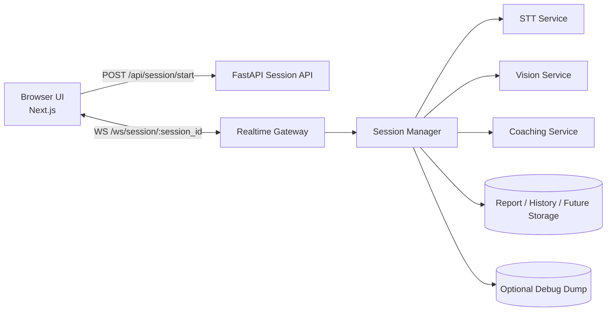

# Speak Up

Speak Up 是一个 AI 演讲训练产品原型，目标是把一次训练拆成完整闭环：

- 开始前选择训练场景与语言
- 训练中持续接收实时反馈
- 训练后生成报告并回看历史记录
- 需要时打开 debug dump，导出完整录音与视频帧样本用于排查

当前这版更偏向“实时训练链路原型”而不是完整生产版，但已经把前后端交互、实时会话、mock 反馈、报告展示和 debug 能力串起来了。

## 当前支持的功能

### 训练场景

当前内置 3 类演讲/表达场景：

- 主持人场景：训练开场、串场、控场和互动感
- 嘉宾分享场景：训练观点表达、逻辑结构和故事组织
- 脱口秀场景：训练节奏、停顿、情绪推进和包袱落点

每个场景都支持：

- 中文 `zh`
- English `en`

### 实时训练页

训练页当前支持：

- 摄像头预览
- 麦克风采集
- 实时 session 创建与 WebSocket 连接
- 实时 transcript 面板
- 实时 insight 面板
- 历史记录侧边栏
- 开始 / 暂停 / 重置 / 结束并生成报告

### 实时反馈

当前实时反馈能力是 mock 驱动，但协议和页面链路是真实的：

- 前端持续发送音频 chunk
- 前端持续发送低频视频帧
- 后端通过 WebSocket 回推：
  - `session_status`
  - `transcript_partial`
  - `transcript_final`
  - `live_insight`

### 报告与历史

当前报告和历史是 mock 数据，但已经有完整页面和数据结构：

- 报告页包含：
  - 总分
  - headline / encouragement
  - 雷达图
  - 建议项
  - 历史对比摘要
- 历史记录页侧边栏支持按当前场景查看历史表现

### Debug Dump

训练页顶部提供 `Debug Dump` 开关，默认关闭。

关闭时：

- 仍然会正常请求麦克风
- 仍然会正常采集并发送音频 chunk
- 仍然会正常发送实时视频帧
- 仍然会正常收到 transcript / insight / report
- 只是后端不写 debug 日志和 dump 文件

打开时：

- 后端会为该次 session 建立 debug 目录
- 保存音频 chunk、视频帧、事件日志
- 在暂停或结束时写出完整录音：
  - `backend/debug/<session_id>/audio/session_full.webm`

---

## 产品怎么用

### 常规使用

1. 启动后端服务
2. 启动前端服务
3. 打开浏览器访问 `http://localhost:3000`
4. 选择场景与语言
5. 如果只是正常体验，保持 `Debug Dump` 为关闭
6. 点击开始，并允许浏览器访问摄像头和麦克风
7. 观察实时文字稿和实时分析面板
8. 点击暂停、重置，或点击“结束并生成报告”

### 需要 debug 时

1. 在开始前把 `Debug Dump` 打开
2. 点击开始并进行一次训练
3. 训练中后端会保存音频 chunk / 视频帧 / events
4. 点击暂停或结束后，查看：

```text
backend/debug/<session_id>/
  metadata.json
  events.jsonl
  audio/
    audio_0001.webm
    audio_0002.webm
    ...
    session_full.webm
  frames/
    frame_0001.jpg
    frame_0002.jpg
    ...
```

说明：

- `audio_000x.webm` 是流式分片，主要用于排查原始上行数据
- 真正适合浏览器回放的是 `session_full.webm`

---

## 如何在本地运行

### 环境要求

- Node.js 20+
- npm
- Python 3.11+

### 1. 启动前端

```bash
npm install
cp .env.example .env.local
npm run dev
```

默认前端地址：

```text
http://localhost:3000
```

`.env.example` 当前只包含一个前端环境变量：

```bash
NEXT_PUBLIC_API_BASE_URL=http://127.0.0.1:8000
```

### 2. 启动后端

首次启动：

```bash
python3 -m venv backend/.venv
source backend/.venv/bin/activate
pip install -r backend/requirements.txt
uvicorn app.main:app --reload --app-dir backend --port 8000
```

默认后端地址：

```text
http://127.0.0.1:8000
```

后端健康检查：

```bash
curl http://127.0.0.1:8000/health
```

如果你更新了 `backend/requirements.txt`，记得重新安装依赖并重启 `uvicorn`。

### 3. 浏览器权限

训练页需要浏览器授权：

- Microphone
- Camera

如果麦克风或摄像头被系统层面拒绝，训练页会显示错误或退化为非完整体验。

---

## 代码结构

```text
.
├── src/
│   ├── app/
│   │   ├── page.tsx                 # 首页 / 训练页入口
│   │   ├── session/page.tsx         # 训练页
│   │   └── report/page.tsx          # 报告页
│   ├── components/
│   │   ├── session/                 # 训练页组件
│   │   ├── report/                  # 报告页组件
│   │   └── ui/                      # 基础 UI
│   ├── hooks/
│   │   └── useMockSession.ts        # 前端 realtime session 核心逻辑
│   ├── lib/
│   │   └── api.ts                   # 前端 API 封装
│   └── types/
│       ├── report.ts
│       └── session.ts
├── backend/
│   ├── app/
│   │   ├── data/                    # mock 场景、历史、session stream 数据
│   │   ├── services/
│   │   │   ├── session_manager.py   # realtime session 聚合层
│   │   │   ├── debug_store.py       # debug 文件落盘
│   │   │   ├── stt_service.py       # mock STT 抽象
│   │   │   ├── vision_service.py    # mock 视觉抽象
│   │   │   └── coaching_service.py  # mock coaching 抽象
│   │   ├── main.py                  # FastAPI 入口
│   │   └── schemas.py               # 后端 schema
│   ├── REALTIME_ARCHITECTURE.md     # realtime 设计文档
│   └── requirements.txt
├── .env.example
├── AGENTS.md
└── README.md
```

---

## 当前系统是怎么设计的

### 总体思路

产品被拆成两条平行链路：

- REST 控制面：启动 session、结束 session、获取场景、获取历史、获取报告
- WebSocket 实时面：承接训练中的音频 chunk、视频帧和实时反馈

### 高层架构



### 前端职责

前端主要由 3 层组成：

- `SessionWorkspace`
  - 编排训练页
  - 管理场景、语言、debug 开关、历史面板
- `useMockSession`
  - 创建 realtime session
  - 建立 WebSocket
  - 请求麦克风和摄像头
  - 发送音频 chunk / 视频帧
  - 接收 transcript / insight / status
  - 在需要 debug 时生成并上传 `session_full.webm`
- `SessionProvider`
  - 管报告页和历史页所需的共享状态

### 后端职责

后端当前由 `FastAPI + SessionManager` 驱动：

- `main.py`
  - 提供 REST 路由和 WebSocket 路由
- `session_manager.py`
  - 管 session 生命周期
  - 聚合 socket 连接
  - 接收 `audio_chunk` / `video_frame`
  - 广播 transcript / insight / status
  - 在 debug 打开时落日志与文件
- `debug_store.py`
  - 管理 `backend/debug/<session_id>/...` 目录
  - 保存 chunk、帧、events、`session_full.webm`

### 为什么完整录音不是后端拼 chunk

这是当前架构里的一个关键决定。

浏览器 `MediaRecorder` 的 timeslice 分片不适合被当成“每段都是独立完整 webm 文件”。因此当前实现不是让后端去拼接 `audio_0002.webm`、`audio_0003.webm` 这类 chunk，而是：

- 前端继续实时发送音频 chunk，保持实时链路
- 同时前端在内存里保留完整录音 blob
- 在暂停或结束时，把完整录音一次性上传
- 后端直接保存为：
  - `session_full.webm`

这样做更稳，也更适合作为 debug artifact。

---

## 当前 API 概览

### REST

- `GET /health`
- `GET /api/scenarios`
- `GET /api/history`
- `GET /api/session-stream`
- `GET /api/report`
- `POST /api/session/start`
- `GET /api/session/{session_id}`
- `POST /api/session/{session_id}/finish`
- `POST /api/session/{session_id}/inject-transcript`
- `POST /api/session/{session_id}/inject-insight`
- `POST /api/session/{session_id}/debug/full-audio`

### WebSocket

- `WS /ws/session/{session_id}`

前端发送：

- `ping`
- `start_stream`
- `audio_chunk`
- `video_frame`
- `inject_partial`
- `inject_transcript`
- `inject_insight`

后端回推：

- `session_status`
- `transcript_partial`
- `transcript_final`
- `live_insight`
- `ack`
- `error`
- `pong`

---

## 当前限制

这版仓库仍然是原型，主要限制包括：

- transcript / insight 还是 mock 数据，不是从真实用户音频识别出来的
- 视频帧虽然已经上行，但还没有做真实视觉分析
- 报告和历史是静态模板，没有真实 session 落库
- session 目前在内存里管理，后端重启后会丢失
- 没有用户体系、鉴权、持久化存储、对象存储和异步任务系统

---

## 后续还能怎么扩展

下面这些方向都比较自然，而且和当前代码结构匹配。

### 1. 接入真实 STT

目标：

- 用真实用户语音替换 mock transcript

怎么做：

- 保留 `audio_chunk` 上行协议
- 在 `backend/app/services/stt_service.py` 接入真实供应商
- 让 `SessionManager` 不再只从 `session_stream.py` 取 mock 数据，而是消费 STT partial / final 结果

推荐实现：

- 先接 OpenAI Realtime / Deepgram / AssemblyAI 这类流式接口
- 如果要离线或自托管，再考虑 `faster-whisper`

### 2. 接入真实视觉分析

目标：

- 让实时 insight 不只看 mock 文案，而是真正参考镜头状态

怎么做：

- 保留 `video_frame` 上行
- 在 `backend/app/services/vision_service.py` 分析：
  - 视线
  - 头部姿态
  - 人脸是否离开镜头
  - 表情与动作稳定性
- 再由 `coaching_service.py` 合并 transcript + vision 结果

推荐实现：

- 原型阶段优先 OpenCV / MediaPipe
- 后续如果要复杂场景，再引入更重的多模态模型

### 3. 把报告改成真实生成

目标：

- 根据这次 session 的真实内容生成报告，而不是按场景返回固定模板

怎么做：

- 汇总：
  - transcript 全量文本
  - 视觉统计
  - 实时反馈事件
  - pause / finish 时间点
- 增加 report generation service
- 把 `GET /api/report` 从模板读取改成按 session 读取

推荐实现：

- 先同步生成
- 再演进成异步任务 + 轮询/订阅

### 4. 增加持久化与历史归档

目标：

- 让历史记录来自真实训练，而不是 mock 数据

怎么做：

- 增加数据库表或文档存储
- 把 session 元数据、报告摘要、评分、debug 路径写进去
- 历史页直接读真实历史

推荐实现：

- 原型阶段可以 SQLite / Postgres
- debug 文件可落本地或对象存储

### 5. 多用户与生产化能力

目标：

- 从单人本地原型演进成可部署系统

怎么做：

- 增加登录态和用户隔离
- 给 session / report / history 加 user 维度
- 把内存态 session 管理改成可恢复设计
- 加上传大小限制、鉴权、对象存储和任务队列

### 6. 更强的 debug 能力

目标：

- 让排查实时链路更高效

怎么做：

- 在页面上直接显示 session debug 状态
- 增加 debug artifact 下载入口
- 在 events 里补更多 timing 指标
- 引入“只保留最近 N 次 debug session”的自动清理策略

---

## 相关文档

- realtime 设计文档：`backend/REALTIME_ARCHITECTURE.md`
- 仓库协作说明：`AGENTS.md`
