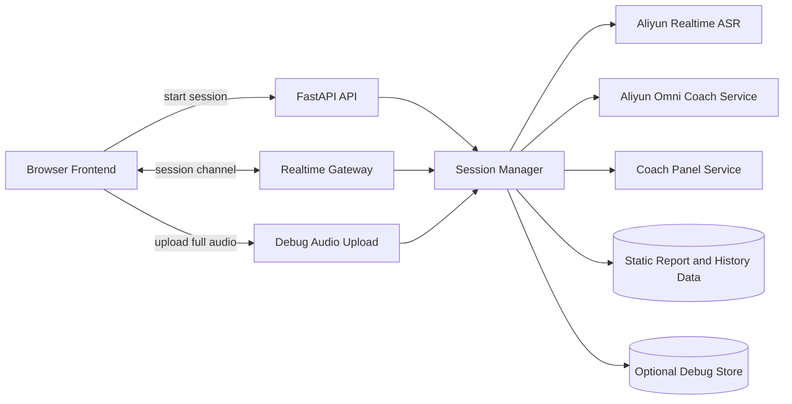

# Speak Up Realtime Architecture

## 文档目的

这份文档描述当前仓库里 realtime 训练链路的真实实现状态。

重点回答 4 件事：

- 现在系统哪些能力是真的
- 当前实时链路是怎么跑起来的
- debug 和 replay 为什么这样设计
- 后面应该按什么顺序扩展

## 当前状态总览

### 已落地

- session 创建、查询、结束
- 浏览器到后端的 WebSocket realtime 通道
- 浏览器麦克风 `PCM 16k mono` 实时上行
- 阿里云 `qwen3-asr-flash-realtime`
- 实时 `transcript_partial` / `transcript_final`
- transcript 时间轴
- 阿里云 `Qwen3.5-Omni-Realtime` 驱动的 `AI Live Coach`
- debug 开关
- debug 模式下的 `session_full.webm`
- 基于 transcript 的 replay 页面

### 仍然是 mock 或静态数据

- `GET /api/report`
- `GET /api/history`
- 语音播报
- session 持久化

### 已接入但仍然偏规则化

- transcript 规则分析
- `coach_panel` 的 summary 与三维卡片聚合

一句话总结：

当前系统已经完成“真实实时转写 + Omni Live Coach V1”两条主链路，但报告、历史和语音播报仍然是原型层实现。

## 当前架构



## 运行时链路

### 1. 创建 session

前端调用：

- `POST /api/session/start`

后端返回：

- `sessionId`
- `websocketUrl`
- 当前 session 元信息

这一步只创建 session，不会立刻开始实时识别。

### 2. 建立 WebSocket

前端连接：

- `WS /ws/session/:session_id`

连接建立后，后端先推一条 `session_status`，前端再发送：

- `start_stream`

### 3. 启动实时 provider

`start_stream` 到达后，`SessionManager` 会：

- 为当前 session 建立阿里云 ASR 连接
- 在同一个 Python 进程里并行建立 Omni coach 连接
- 两条连接各自发送 `session.update`
- 两条连接都使用 `server_vad`

对应 provider 当前由这两个模块管理：

- [stt_service.py](/Users/bytedance/my_project/speak_up/backend/app/services/stt_service.py)
- [omni_service.py](/Users/bytedance/my_project/speak_up/backend/app/services/omni_service.py)

### 4. 音频上行

前端在 [useMockSession.ts](/Users/bytedance/my_project/speak_up/src/hooks/useMockSession.ts) 里通过 `AudioWorklet` 采集麦克风，并把音频转成：

- `audio/pcm`
- `16000 Hz`
- `mono`

前端上行消息：

```json
{
  "type": "audio_chunk",
  "timestamp_ms": 1710000000000,
  "payload": "<base64-pcm-bytes>",
  "mime_type": "audio/pcm",
  "sample_rate_hz": 16000,
  "channels": 1
}
```

后端收到后会并行分发：

- 给 `qwen3-asr-flash-realtime` 发送 `input_audio_buffer.append`
- 给 `Qwen3.5-Omni-Realtime` 发送 `input_audio_buffer.append`

这两条 provider 逻辑上并行，但当前仍然运行在同一个 FastAPI 进程里。

### 5. 视频帧上行

前端当前大约每 `1s` 发送一张 JPEG 帧。

这条链路同时服务于两件事：

- debug 模式下保存 `frame_000x.jpg`
- 非 debug 模式下作为 Omni coach 的视觉输入

为适配 Omni 官方建议，前端当前会把截图压到不高于 `1280x720`，并维持低频关键帧输入，而不是原始视频流。

### 6. transcript 回推

阿里云返回的关键事件有：

- `conversation.item.input_audio_transcription.text`
- `conversation.item.input_audio_transcription.completed`
- `input_audio_buffer.speech_started`
- `input_audio_buffer.speech_stopped`

后端映射为前端事件：

- `transcript_partial`
- `transcript_final`
- `error`

时间戳优先使用阿里云返回的 `speech_started / speech_stopped`，如果 provider 没给，再退回本地 elapsed time 兜底。

### 7. Omni Live Coach 回推

`Qwen3.5-Omni-Realtime` 当前只配置文本输出，不负责实时字幕，也不负责语音回复。

运行方式：

- 音频与视频帧持续流式输入同一个 realtime session
- `server_vad` 负责决定何时触发一轮 coach 响应
- 服务端监听 `response.text.delta` / `response.text.done`
- 当前只在 `response.text.done` 时做 JSON 解析
- 解析成功后先映射成内部 coach 信号，再聚合进固定三维 `coach_panel`

当前 coach 主面板的内部来源有两类：

- `speech-rule`
- `omni-coach`

右侧主 UI 不再直接消费滚动 `live_insight`，而是消费统一的 `coach_panel` 状态：

- 顶部一条当前重点建议
- 三张固定维度卡
  - `body_expression`
  - `voice_pacing`
  - `content_expression`

`live_insight` 仍然保留，但主要服务 debug 和过渡期兼容。

### 8. 结束 session

前端点击结束时：

1. 先收尾本地录音
2. 上传 `session_full.webm`
3. 调用 `POST /api/session/{session_id}/finish`

后端会：

- 给阿里云发送 `session.finish`
- 等待 `session.finished`
- 广播 `session_status=finished`

## 双音频链路设计

这是当前架构里最关键的设计决定。

### 主链路

主链路只服务于实时识别：

- 输入：麦克风
- 编码：PCM 16k mono
- 用途：低延迟 ASR
- 落盘：debug 模式下保存为 `audio_000x.pcm`

### debug 链路

debug 链路只服务于回放和排障：

- 输入：同一个麦克风流
- 编码：浏览器 `MediaRecorder`
- 用途：生成完整可播放录音
- 落盘：`session_full.webm`

### 为什么不让后端拼 chunk

因为 `MediaRecorder` 的 timeslice 分片不等价于“每片都是独立完整的可播放 WebM 文件”。如果把这些 chunk 当完整媒体去拼，会遇到容器头、可播放性和浏览器兼容问题。

所以当前实现选择：

- 实时识别走 PCM
- 回放走完整 WebM

这样实时链路和调试链路各自稳定。

## transcript 处理策略

### 句子边界

当前句子边界主要信任 provider：

- 阿里云 `server_vad` 负责断句
- 默认 `ALIYUN_REALTIME_ASR_SILENCE_DURATION_MS=1200`

这意味着：

- 实时字幕切句主要由阿里云控制
- 前端不再做复杂的人为断句推断

### 当前唯一保留的应用层补偿

后端当前只保留两类窄规则：

- transcript 层的语气词尾巴合并
- posture 层的姿态信号聚合与提示生成

其中 transcript 部分：

- 如果某条 final transcript 只是 `嗯 / 哦 / 诶 / 哎 / 唉` 这类语气词尾巴
- 并且说话人和上一条一致
- 则把它并回上一条 transcript

对应实现见 [session_manager.py](/Users/bytedance/my_project/speak_up/backend/app/services/session_manager.py)。

这条规则存在的原因很简单：

- provider 偶尔会把尾部语气词单独切成一条 final
- 直接展示会让 transcript 可读性变差

除此之外，当前不会再做人为的长文本重叠合并。

## debug 与 replay

### debug 开关

`debugEnabled=false` 时：

- 实时 ASR 仍然正常工作
- 视频帧仍然会上行
- 后端不写 debug 文件

`debugEnabled=true` 时：

- 记录 `metadata.json`
- 记录 `events.jsonl`
- 记录 provider 事件
- 保存 `audio_000x.pcm`
- 保存 `frame_000x.jpg`
- 在 pause / finish 时保存 `session_full.webm`

### Coach Debug 开关

`Coach Debug` 和 `Debug Dump` 是两套不同目的的开关：

- `Debug Dump`：控制是否写磁盘证据
- `Coach Debug`：控制是否在前端显示模型原始调试信息

`Coach Debug` 打开后：

- 右侧分析区会显示 `Omni Debug · Server`
- 同时保留最近几条 insight trace，方便核对模型输出和 `coach_panel` 聚合结果

### debug 目录

```text
backend/debug/<session_id>/
  metadata.json
  events.jsonl
  audio/
    audio_0001.pcm
    audio_0002.pcm
    ...
    session_full.webm
  frames/
    frame_0001.jpg
    frame_0002.jpg
    ...
```

### replay 数据来源

当前 replay 页面依赖：

- session 内存里的 `transcript_chunks`
- debug 模式下的 `session_full.webm`

后端接口：

- `GET /api/session/{session_id}/replay`
- `GET /api/session/{session_id}/media/audio`

注意：

- 如果 session 不存在，前端 replay 页面当前会退回 demo 数据
- 这说明 replay UI 是可用的，但持久化还没有完成

## 当前协议

### REST

核心接口：

- `GET /health`
- `GET /api/scenarios`
- `POST /api/session/start`
- `GET /api/session/{session_id}`
- `POST /api/session/{session_id}/finish`
- `GET /api/session/{session_id}/replay`
- `GET /api/session/{session_id}/media/audio`
- `POST /api/session/{session_id}/debug/full-audio`

原型接口：

- `GET /api/history`
- `GET /api/report`
- `GET /api/session-stream`
- `POST /api/session/{session_id}/inject-transcript`
- `POST /api/session/{session_id}/inject-insight`

### WebSocket

前端发送：

- `ping`
- `start_stream`
- `audio_chunk`
- `video_frame`
- `inject_partial`
- `inject_transcript`
- `inject_insight`

后端回推：

- `session_status`
- `transcript_partial`
- `transcript_final`
- `live_insight`
- `coach_panel`
- `omni_debug`
- `ack`
- `pong`
- `error`

## 关键模块职责

### [main.py](/Users/bytedance/my_project/speak_up/backend/app/main.py)

负责：

- FastAPI 路由
- WebSocket 入口
- replay 媒体下载
- debug 完整录音上传接口

### [session_manager.py](/Users/bytedance/my_project/speak_up/backend/app/services/session_manager.py)

负责：

- session 生命周期
- socket 管理
- 把前端音频并行转发给 ASR 和 Omni coach
- 把前端视频帧转发给 Omni coach
- 把 provider transcript 广播给前端
- 维护 session 内存态 transcript
- 广播 `coach_panel`
- 广播 `omni_debug`
- debug 落盘
- live insight 与面板状态的统一分发

### [stt_service.py](/Users/bytedance/my_project/speak_up/backend/app/services/stt_service.py)

负责：

- 管理阿里云 realtime 连接
- 发送 `session.update`
- 转发 `input_audio_buffer.append`
- 接收并解析 provider 事件
- 暴露 partial / final / error 回调

### [omni_service.py](/Users/bytedance/my_project/speak_up/backend/app/services/omni_service.py)

负责：

- 管理阿里云 `Qwen3.5-Omni-Realtime` 连接
- 持续接收 PCM 音频和 JPEG 帧
- 分别管理 `voice_content` 和 `body_visual` 两条 coach lane
- 解析 `response.text.done`
- 把模型输出映射成结构化 `CoachPanelPatch`
- 对重复 coach patch 做轻量去重

### [debug_store.py](/Users/bytedance/my_project/speak_up/backend/app/services/debug_store.py)

负责：

- session debug 目录初始化
- 保存音频 chunk
- 保存完整录音
- 保存视频帧
- 保存 provider 事件和 transcript merge 事件

## 当前配置项

后端当前依赖这些环境变量：

```bash
DASHSCOPE_API_KEY=your_key
ALIYUN_REALTIME_ASR_MODEL=qwen3-asr-flash-realtime
ALIYUN_REALTIME_ASR_URL=wss://dashscope.aliyuncs.com/api-ws/v1/realtime
ALIYUN_REALTIME_ASR_VAD_THRESHOLD=0.0
ALIYUN_REALTIME_ASR_SILENCE_DURATION_MS=1200
ALIYUN_OMNI_COACH_ENABLED=true
ALIYUN_OMNI_COACH_MODEL=qwen3.5-omni-flash-realtime
ALIYUN_OMNI_COACH_URL=wss://dashscope.aliyuncs.com/api-ws/v1/realtime
ALIYUN_OMNI_COACH_VAD_THRESHOLD=0.0
ALIYUN_OMNI_COACH_SILENCE_DURATION_MS=2000
ALIYUN_OMNI_BODY_TRIGGER_INTERVAL_MS=1500
```

其中：

- `DASHSCOPE_API_KEY` 必填
- `ALIYUN_REALTIME_ASR_SILENCE_DURATION_MS` 越大，断句越慢，最终句稳定性通常越高
- `ALIYUN_OMNI_COACH_ENABLED=true` 时，右侧 `AI Live Coach` 会尝试接入 Omni
- `ALIYUN_OMNI_COACH_SILENCE_DURATION_MS` 控制 `voice_content` 这条 lane 的 VAD 触发节奏
- `ALIYUN_OMNI_BODY_TRIGGER_INTERVAL_MS` 控制 `body_visual` 这条 lane 的手动视觉刷新频率

## 当前 Live Coach 设计

当前 `AI Live Coach` 已经收敛成“后端统一多模态分析 + 前端固定三维卡片”：

- 前端只负责上行音频和约 `1s` 一张的视频帧
- 后端用阿里云 `Qwen3.5-Omni-Realtime` 统一做视觉与语音理解
- `speech_analysis_service.py` 继续提供一层轻量 transcript 规则分析
- `coach_panel_service.py` 统一聚合 `body_expression / voice_pacing / content_expression`

当前没有再保留浏览器本地姿态识别运行时链路。
- 优先判断肩线、居中和上身稳定性
- “站姿”类文案会改成“上身姿态”或“肩线”

## 当前限制

- `live_insight` 当前已经是“规则姿态 + Omni coach”双来源，但仍未进入报告层
- `GET /api/report` 仍然返回静态模板
- `GET /api/history` 仍然返回静态历史数据
- session 没有落库，后端重启后 replay 会丢
- 当前只支持音频回放，不支持真实视频回放
- transcript 结构仍然比较轻，暂时没有把 `emotion / language / item_id` 暴露到上层 schema

## 后续路线

### Phase 2：Omni Coach 深化

目标：

- 在当前音频 + 帧输入基础上继续调 prompt 和 JSON schema
- 让 Omni 输出更稳定的 delivery / visual 分类
- 尝试把姿态规则摘要作为附加上下文输入给 Omni

建议做法：

- 保持当前 `1 fps` 关键帧策略
- 优化 VAD 响应节奏和展示节流
- 增加 Omni provider debug 可视化

### Phase 3：语音播报

目标：

- 让教练反馈可实时播报

建议做法：

- 接入 TTS 或 Omni 语音输出
- 增加前端播放队列
- 处理打断、暂停和多段音频拼接

### Phase 4：真实报告和历史

目标：

- 基于真实 session 生成报告
- 用真实训练记录替换静态历史

建议做法：

- 持久化 transcript、insight、评分和回放地址
- 引入数据库和对象存储
- report 生成从“按场景模板”改成“按 session 计算”

### Phase 5：生产化

目标：

- 从本地原型演进成可部署系统

建议做法：

- 用户体系
- 鉴权
- 异步任务
- 对象存储
- 监控与清理策略

## 当前判断

这版架构最核心的变化已经完成：

- realtime 主链路从 mock transcript 变成了真实阿里云 ASR
- debug 和 replay 没被这次接入破坏

接下来不该再回头重做音频底座，而应该基于这条已跑通的链路继续往上接：

1. 真实视觉分析
2. 真实报告和历史
3. 语音播报
4. 持久化和生产化能力
