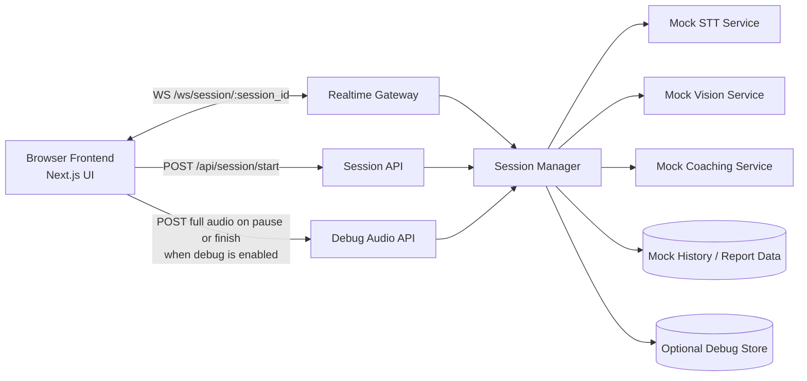

# Speak Up Realtime Architecture

## 文档目的

这份文档描述的是 `Speak Up` 当前 realtime 训练链路的设计与实现状态，以及后续如何从 mock 原型演进到真实 AI 演讲助手。

它不是纯 proposal，而是“当前实现 + 后续扩展路线”的组合文档。

---

## 当前目标

当前版本的重点不是“真实 ASR 和真实视觉分析已经上线”，而是先把这些核心链路打通：

- session 生命周期
- WebSocket 实时通道
- 音频 chunk / 视频帧上行
- transcript / insight 实时回推
- 结束后进入报告页
- 可选 debug dump

也就是说，当前版本解决的是“产品骨架”和“协议骨架”，为后面替换真实能力留接口。

---

## 当前实现状态

截至当前版本，已经实现：

- `POST /api/session/start`
- `GET /api/session/{session_id}`
- `POST /api/session/{session_id}/finish`
- `WS /ws/session/{session_id}`
- `POST /api/session/{session_id}/debug/full-audio`
- 音频 chunk 上行
- 视频帧上行
- mock transcript partial / final 回推
- mock live insight 回推
- 静态 report / history 页面
- debug 开关
  - 默认关闭
  - 关闭时不写 debug 文件
  - 打开时保存 chunk、帧、事件日志和 `session_full.webm`

当前还没有实现：

- 真实 STT
- 真实视觉分析
- 真实报告生成
- session / report 持久化

---

## 总体架构



### 两条主链路

#### 1. 控制面

负责：

- 创建 session
- 查询 session
- 结束 session
- 获取场景 / 历史 / 报告

#### 2. 实时面

负责：

- 音频 chunk 上行
- 视频帧上行
- transcript / insight 回推
- status 广播

---

## 为什么不用整段视频直传

在浏览器实时训练场景里，整段视频直传后端不是一个好的第一阶段方案，原因包括：

- 带宽压力大
- 延迟不可控
- 服务端解码成本高
- 不利于快速替换 STT / vision / coaching

所以当前架构刻意拆成：

- 音频：持续切块上传
- 视频：低频抽帧上传
- 后端：聚合成实时反馈
- 结束后：按需要生成完整报告

这也是后续接真实 STT 和视觉分析最稳的演进路径。

---

## Session 生命周期

### 1. Start

前端点击开始后：

1. `POST /api/session/start`
2. 返回 `sessionId` 与 `websocketUrl`
3. 浏览器建立 WebSocket
4. 浏览器发送 `start_stream`
5. 开始采集麦克风
6. 开始按固定周期发送视频帧

### 2. Running

运行中：

- 音频 chunk 持续发送到后端
- 视频帧持续发送到后端
- 后端按 mock timeline 推送 transcript / insight

### 3. Pause

点击暂停后：

- 前端停止录音
- 等最后一个 chunk flush 完成
- 如果 `debugEnabled=true`
  - 前端把完整录音 blob 上传到后端
  - 后端保存为 `session_full.webm`
- 当前 pause 主要是前端层面的录音暂停，不是单独的后端 pause 状态

### 4. Finish

点击结束并生成报告后：

- 前端先 finalize 当前完整录音
- 如果 `debugEnabled=true`
  - 上传 `session_full.webm`
- 然后调用 `POST /api/session/{session_id}/finish`
- 跳转报告页

### 5. Reset

点击重置后：

- 清空前端当前 session 视图
- 关闭 socket
- 停止录音
- 不生成报告

---

## WebSocket 协议

### 前端 -> 后端

#### `ping`

```json
{ "type": "ping" }
```

#### `start_stream`

```json
{ "type": "start_stream" }
```

#### `audio_chunk`

```json
{
  "type": "audio_chunk",
  "timestamp_ms": 1200,
  "payload": "<data-url-base64>",
  "mime_type": "audio/webm;codecs=opus"
}
```

#### `video_frame`

```json
{
  "type": "video_frame",
  "timestamp_ms": 1400,
  "image_base64": "data:image/jpeg;base64,..."
}
```

#### 手动注入调试消息

```json
{ "type": "inject_partial", "text": "..." }
```

```json
{
  "type": "inject_transcript",
  "text": "...",
  "timestamp_label": "00:12"
}
```

```json
{
  "type": "inject_insight",
  "title": "...",
  "detail": "...",
  "tone": "positive"
}
```

### 后端 -> 前端

#### `session_status`

```json
{
  "type": "session_status",
  "sessionId": "session-123",
  "status": "streaming"
}
```

#### `transcript_partial`

```json
{
  "type": "transcript_partial",
  "text": "大家晚上好，欢迎来到..."
}
```

#### `transcript_final`

```json
{
  "type": "transcript_final",
  "chunk": {
    "id": "tx-12",
    "speaker": "user",
    "text": "大家晚上好，欢迎来到今天的活动现场。",
    "timestampLabel": "00:12"
  }
}
```

#### `live_insight`

```json
{
  "type": "live_insight",
  "insight": {
    "id": "ins-5",
    "title": "眼神交流稳定",
    "detail": "你刚刚的镜头注视更自然，表达可信度更高。",
    "tone": "positive"
  }
}
```

#### 其他事件

- `ack`
- `error`
- `pong`

---

## 当前后端模块职责

### `main.py`

负责：

- 定义 REST 路由
- 定义 WebSocket 路由
- 连接 `SessionManager`

### `session_manager.py`

这是当前 realtime 核心聚合层，负责：

- session 创建 / 查询 / 结束
- socket 连接管理
- 接收 client message
- 广播 status / transcript / insight
- 决定是否写 debug

### `debug_store.py`

只在 `debugEnabled=true` 时参与工作，负责：

- 初始化 `backend/debug/<session_id>/`
- 保存 `metadata.json`
- 追加 `events.jsonl`
- 保存 `audio_000x.webm`
- 保存 `frame_000x.jpg`
- 保存 `session_full.webm`

### `stt_service.py`

当前只是 mock：

- 接收音频 chunk 数量
- 生成简单 ack
- 生成 partial text 截断文本

未来这里应该替换成真实 STT provider 封装层。

### `vision_service.py`

当前只是 mock：

- 接收视频帧计数
- 返回简单 ack

未来这里应该替换成真实视觉分析层。

### `coaching_service.py`

当前也是 mock：

- 把 insight 数据包装成标准事件

未来这里应该承担 transcript + vision 的融合反馈逻辑。

---

## Debug 架构说明

### Debug 开关

每个 session 都有 `debugEnabled`：

- 默认 `false`
- 关闭时：
  - 仍然正常请求麦克风
  - 仍然正常发送音频 chunk
  - 仍然正常发送视频帧
  - 只是后端不写 debug 文件
- 打开时：
  - 后端初始化 debug session 目录
  - 写入 events / audio chunk / frames
  - 暂停或结束时保存完整录音

### 为什么 `session_full.webm` 由前端 finalize

这是当前 debug 设计里的一个关键决策。

浏览器 `MediaRecorder.start(timeslice)` 产生的是连续录音流的分段。后续分片通常不适合被当成“独立可播放文件”使用，所以不能指望服务端简单拼 `audio_0001.webm + audio_0002.webm + ...` 来得到稳定可播的文件。

因此当前策略是：

- 实时上行时继续发送 chunk，保持实时链路
- 前端额外缓存完整录音 blob
- 在暂停或结束时上传完整 blob
- 后端直接保存为 `session_full.webm`

这比服务端 remux 分片更稳定，也更适合当前原型阶段。

---

## 当前实现与最初方案的差异

最初的架构目标是先完成 Phase 1 假实时，再逐步替换真实服务。当前已经比最早的 Phase 1 多做了一步：

- 增加了完整 debug 录音导出能力
- 增加了可控的 debug 开关

但仍然没有越过这些边界：

- transcript 仍然不是由真实音频识别得到
- insight 仍然不是由真实视觉分析和 coaching 生成
- report 仍然不是由真实 session 汇总生成

---

## 当前限制

- session 只存在于后端内存中
- 后端重启后 session 状态会丢失
- `history.py` 和 `report` 仍然是静态模板
- debug 文件保存在本地磁盘，不适合生产环境
- pause 目前更偏“前端录音暂停”，没有独立后端 pause 状态机

---

## 后续演进路线

## Phase 2：接入真实 STT

### 目标

把 `audio_chunk` 接到真实 ASR，生成 partial / final transcript。

### 怎么做

- 保留当前 `audio_chunk` 协议
- 在 `stt_service.py` 抽象真实 provider
- 让 `SessionManager` 不再只读 mock `session_stream`
- 按 provider 回调广播：
  - `transcript_partial`
  - `transcript_final`

### 推荐 provider

- OpenAI Realtime
- Deepgram
- AssemblyAI
- 自托管时可考虑 `faster-whisper`

---

## Phase 3：接入真实视频帧分析

### 目标

让 live insight 能基于真实镜头状态工作。

### 怎么做

- 保留当前 `video_frame` 协议
- 在 `vision_service.py` 里分析：
  - gaze
  - head pose
  - face presence
  - expression / motion
- 把视觉结果交给 `coaching_service.py`

### 推荐落地

- 原型阶段优先 OpenCV / MediaPipe
- 后续再考虑更重的多模态模型

---

## Phase 4：结束后生成真实报告

### 目标

把报告从场景模板升级成 session 级真实报告。

### 怎么做

- 汇总：
  - transcript 全量文本
  - insight 时间轴
  - 视觉统计
  - debug metadata
- 增加 report generation service
- `GET /api/report` 支持按 session 查询

### 推荐策略

- 原型先同步生成
- 生产再改为异步生成 + 持久化

---

## Phase 5：持久化与多用户化

### 目标

从单机原型演进成可多人使用的系统。

### 怎么做

- 给 session / report / history 增加数据库持久化
- 给 debug 文件接对象存储
- 增加 auth 与 user 维度隔离
- 把内存态 session manager 升级为可恢复设计

---

## 推荐落地顺序

1. 先把真实 STT 接进 `stt_service.py`
2. 再把真实 vision 接进 `vision_service.py`
3. 再做 report generation 和历史持久化
4. 最后做 auth、对象存储、任务系统和多用户化

---

## 当前结论

当前 `Speak Up` 的 realtime 架构已经完成了最重要的骨架：

- 前后端 session 生命周期
- WebSocket 实时协议
- 音频 chunk / 视频帧上行
- transcript / insight 回推
- 可控 debug dump
- 完整录音导出

接下来真正的工作重点，不是再改基础协议，而是把 mock 的 `stt / vision / report` 一个个替换成真实能力。
