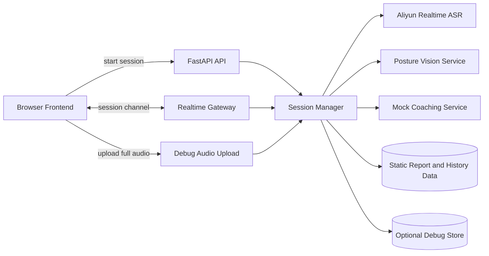

# Speak Up Realtime Architecture

## 文档目的

这份文档描述当前仓库里 realtime 训练链路的真实实现状态。

重点回答 4 件事：

- 现在系统哪些能力是真的
- 当前实时链路是怎么跑起来的
- debug 和 replay 为什么这样设计
- 后面应该按什么顺序扩展

## 当前状态总览

### 已落地

- session 创建、查询、结束
- 浏览器到后端的 WebSocket realtime 通道
- 浏览器麦克风 `PCM 16k mono` 实时上行
- 阿里云 `qwen3-asr-flash-realtime`
- 实时 `transcript_partial` / `transcript_final`
- transcript 时间轴
- debug 开关
- debug 模式下的 `session_full.webm`
- 基于 transcript 的 replay 页面

### 仍然是 mock 或静态数据

- `GET /api/report`
- `GET /api/history`
- 大模型级视觉理解
- 语音播报
- session 持久化

### 已接入但仍然偏规则化

- 前端本地姿态识别
- 后端姿态聚合
- 基于姿态规则的 `live_insight`
- `Pose Debug` 本地/服务端可视化

一句话总结：

当前系统已经完成“真实实时转写 + 姿态识别 V1”这两条主链路，但报告、历史和大模型视觉理解仍然是原型层实现。

## 当前架构



## 运行时链路

### 1. 创建 session

前端调用：

- `POST /api/session/start`

后端返回：

- `sessionId`
- `websocketUrl`
- 当前 session 元信息

这一步只创建 session，不会立刻开始实时识别。

### 2. 建立 WebSocket

前端连接：

- `WS /ws/session/:session_id`

连接建立后，后端先推一条 `session_status`，前端再发送：

- `start_stream`

### 3. 启动实时 ASR

`start_stream` 到达后，`SessionManager` 会：

- 为当前 session 建立阿里云 realtime 连接
- 发送 `session.update`
- 使用 `server_vad`
- 开始接收 provider partial / final

阿里云 provider 当前由 [stt_service.py](/Users/bytedance/my_project/speak_up/backend/app/services/stt_service.py) 管理。

### 4. 音频上行

前端在 [useMockSession.ts](/Users/bytedance/my_project/speak_up/src/hooks/useMockSession.ts) 里通过 `AudioWorklet` 采集麦克风，并把音频转成：

- `audio/pcm`
- `16000 Hz`
- `mono`

前端上行消息：

```json
{
  "type": "audio_chunk",
  "timestamp_ms": 1710000000000,
  "payload": "<base64-pcm-bytes>",
  "mime_type": "audio/pcm",
  "sample_rate_hz": 16000,
  "channels": 1
}
```

后端收到后直接转发给阿里云：

- `input_audio_buffer.append`

### 5. transcript 回推

阿里云返回的关键事件有：

- `conversation.item.input_audio_transcription.text`
- `conversation.item.input_audio_transcription.completed`
- `input_audio_buffer.speech_started`
- `input_audio_buffer.speech_stopped`

后端映射为前端事件：

- `transcript_partial`
- `transcript_final`
- `error`

时间戳优先使用阿里云返回的 `speech_started / speech_stopped`，如果 provider 没给，再退回本地 elapsed time 兜底。

### 6. 结束 session

前端点击结束时：

1. 先收尾本地录音
2. 上传 `session_full.webm`
3. 调用 `POST /api/session/{session_id}/finish`

后端会：

- 给阿里云发送 `session.finish`
- 等待 `session.finished`
- 广播 `session_status=finished`

## 双音频链路设计

这是当前架构里最关键的设计决定。

### 主链路

主链路只服务于实时识别：

- 输入：麦克风
- 编码：PCM 16k mono
- 用途：低延迟 ASR
- 落盘：debug 模式下保存为 `audio_000x.pcm`

### debug 链路

debug 链路只服务于回放和排障：

- 输入：同一个麦克风流
- 编码：浏览器 `MediaRecorder`
- 用途：生成完整可播放录音
- 落盘：`session_full.webm`

### 为什么不让后端拼 chunk

因为 `MediaRecorder` 的 timeslice 分片不等价于“每片都是独立完整的可播放 WebM 文件”。如果把这些 chunk 当完整媒体去拼，会遇到容器头、可播放性和浏览器兼容问题。

所以当前实现选择：

- 实时识别走 PCM
- 回放走完整 WebM

这样实时链路和调试链路各自稳定。

## transcript 处理策略

### 句子边界

当前句子边界主要信任 provider：

- 阿里云 `server_vad` 负责断句
- 默认 `ALIYUN_REALTIME_ASR_SILENCE_DURATION_MS=1200`

这意味着：

- 实时字幕切句主要由阿里云控制
- 前端不再做复杂的人为断句推断

### 当前唯一保留的应用层补偿

后端当前只保留两类窄规则：

- transcript 层的语气词尾巴合并
- posture 层的姿态信号聚合与提示生成

其中 transcript 部分：

- 如果某条 final transcript 只是 `嗯 / 哦 / 诶 / 哎 / 唉` 这类语气词尾巴
- 并且说话人和上一条一致
- 则把它并回上一条 transcript

对应实现见 [session_manager.py](/Users/bytedance/my_project/speak_up/backend/app/services/session_manager.py)。

这条规则存在的原因很简单：

- provider 偶尔会把尾部语气词单独切成一条 final
- 直接展示会让 transcript 可读性变差

除此之外，当前不会再做人为的长文本重叠合并。

## debug 与 replay

### debug 开关

`debugEnabled=false` 时：

- 实时 ASR 仍然正常工作
- 视频帧仍然会上行
- 后端不写 debug 文件

`debugEnabled=true` 时：

- 记录 `metadata.json`
- 记录 `events.jsonl`
- 记录 provider 事件
- 保存 `audio_000x.pcm`
- 保存 `frame_000x.jpg`
- 在 pause / finish 时保存 `session_full.webm`

### Pose Debug 开关

`Pose Debug` 和 `Debug Dump` 是两套不同目的的开关：

- `Debug Dump`：控制是否写磁盘证据
- `Pose Debug`：控制是否在前端显示姿态调试指标

`Pose Debug` 打开后：

- 左侧相机区会显示本地 `PoseSnapshot`
- 右侧分析区会显示后端最近窗口的聚合结果

这套调试信息不依赖后端写文件，适合在线调阈值。

### debug 目录

```text
backend/debug/<session_id>/
  metadata.json
  events.jsonl
  audio/
    audio_0001.pcm
    audio_0002.pcm
    ...
    session_full.webm
  frames/
    frame_0001.jpg
    frame_0002.jpg
    ...
```

### replay 数据来源

当前 replay 页面依赖：

- session 内存里的 `transcript_chunks`
- debug 模式下的 `session_full.webm`

后端接口：

- `GET /api/session/{session_id}/replay`
- `GET /api/session/{session_id}/media/audio`

注意：

- 如果 session 不存在，前端 replay 页面当前会退回 demo 数据
- 这说明 replay UI 是可用的，但持久化还没有完成

## 当前协议

### REST

核心接口：

- `GET /health`
- `GET /api/scenarios`
- `POST /api/session/start`
- `GET /api/session/{session_id}`
- `POST /api/session/{session_id}/finish`
- `GET /api/session/{session_id}/replay`
- `GET /api/session/{session_id}/media/audio`
- `POST /api/session/{session_id}/debug/full-audio`

原型接口：

- `GET /api/history`
- `GET /api/report`
- `GET /api/session-stream`
- `POST /api/session/{session_id}/inject-transcript`
- `POST /api/session/{session_id}/inject-insight`

### WebSocket

前端发送：

- `ping`
- `start_stream`
- `audio_chunk`
- `video_frame`
- `inject_partial`
- `inject_transcript`
- `inject_insight`

后端回推：

- `session_status`
- `transcript_partial`
- `transcript_final`
- `live_insight`
- `ack`
- `pong`
- `error`

## 关键模块职责

### [main.py](/Users/bytedance/my_project/speak_up/backend/app/main.py)

负责：

- FastAPI 路由
- WebSocket 入口
- replay 媒体下载
- debug 完整录音上传接口

### [session_manager.py](/Users/bytedance/my_project/speak_up/backend/app/services/session_manager.py)

负责：

- session 生命周期
- socket 管理
- 把前端音频转发给 provider
- 把 provider transcript 广播给前端
- 维护 session 内存态 transcript
- 广播 `pose_debug`
- debug 落盘

### [stt_service.py](/Users/bytedance/my_project/speak_up/backend/app/services/stt_service.py)

负责：

- 管理阿里云 realtime 连接
- 发送 `session.update`
- 转发 `input_audio_buffer.append`
- 接收并解析 provider 事件
- 暴露 partial / final / error 回调

### [debug_store.py](/Users/bytedance/my_project/speak_up/backend/app/services/debug_store.py)

负责：

- session debug 目录初始化
- 保存音频 chunk
- 保存完整录音
- 保存视频帧
- 保存 provider 事件和 transcript merge 事件

### [vision_service.py](/Users/bytedance/my_project/speak_up/backend/app/services/vision_service.py)

负责：

- 维护最近姿态窗口
- 判断 `close_up_mode`
- 把姿态指标聚合成后端规则判断
- 返回 `live_insight` 和 `pose_debug`

## 当前配置项

后端当前依赖这些环境变量：

```bash
DASHSCOPE_API_KEY=your_key
ALIYUN_REALTIME_ASR_MODEL=qwen3-asr-flash-realtime
ALIYUN_REALTIME_ASR_URL=wss://dashscope.aliyuncs.com/api-ws/v1/realtime
ALIYUN_REALTIME_ASR_VAD_THRESHOLD=0.0
ALIYUN_REALTIME_ASR_SILENCE_DURATION_MS=1200
```

其中：

- `DASHSCOPE_API_KEY` 必填
- `ALIYUN_REALTIME_ASR_SILENCE_DURATION_MS` 越大，断句越慢，最终句稳定性通常越高

## 当前姿态 V1 设计

当前姿态链路不是大模型视觉理解，而是两层结构：

1. 前端 `MediaPipe Pose`
2. 后端规则聚合

### 前端本地特征

前端大约每 `150ms` 跑一次姿态检测，并低频发送 `pose_snapshot`。当前主要提取：

- `bodyPresent`
- `faceVisible`
- `handsVisible`
- `shoulderVisible`
- `hipVisible`
- `bodyScale`
- `centerOffsetX`
- `shoulderTiltDeg`
- `torsoTiltDeg`
- `gestureActivity`
- `stabilityScore`

### 后端聚合

后端保留最近 `6` 个 `pose_snapshot`，大致覆盖最近 `3s`。在这 3 秒窗口里聚合：

- 身体/脸部/手部/肩膀/髋部可见比例
- 身体尺度均值
- 居中偏移均值
- 肩线/躯干倾斜均值
- 手势活跃度均值
- 稳定性均值

### Close-Up Mode

当前姿态 V1 明确支持桌前近景。

当后端判断：

- 肩膀稳定可见
- 髋部长期不可见
- 脸部可见度较高
- 人体尺度偏大

则会进入 `close_up_mode`。

进入该模式后：

- 不再把“看不到髋部”当成异常
- 姿态提示更偏头肩区域
- 优先判断肩线、居中和上身稳定性
- “站姿”类文案会改成“上身姿态”或“肩线”

## 当前限制

- `live_insight` 当前已经接入姿态识别 V1，但仍然是规则驱动
- `GET /api/report` 仍然返回静态模板
- `GET /api/history` 仍然返回静态历史数据
- session 没有落库，后端重启后 replay 会丢
- 当前只支持音频回放，不支持真实视频回放
- transcript 结构仍然比较轻，暂时没有把 `emotion / language / item_id` 暴露到上层 schema

## 后续路线

### Phase 2：大模型视觉分析

目标：

- 让 `video_frame` 真正进入模型
- 在当前姿态信号之上增加更高层的视觉理解
- 用关键帧和 transcript 生成更自然的教练反馈

建议做法：

- 接阿里云多模态实时能力
- 保持低频关键帧策略
- 由后端统一聚合 transcript 和视觉信号

### Phase 3：语音播报

目标：

- 让教练反馈可实时播报

建议做法：

- 接入 TTS 或 Omni 语音输出
- 增加前端播放队列
- 处理打断、暂停和多段音频拼接

### Phase 4：真实报告和历史

目标：

- 基于真实 session 生成报告
- 用真实训练记录替换静态历史

建议做法：

- 持久化 transcript、insight、评分和回放地址
- 引入数据库和对象存储
- report 生成从“按场景模板”改成“按 session 计算”

### Phase 5：生产化

目标：

- 从本地原型演进成可部署系统

建议做法：

- 用户体系
- 鉴权
- 异步任务
- 对象存储
- 监控与清理策略

## 当前判断

这版架构最核心的变化已经完成：

- realtime 主链路从 mock transcript 变成了真实阿里云 ASR
- debug 和 replay 没被这次接入破坏

接下来不该再回头重做音频底座，而应该基于这条已跑通的链路继续往上接：

1. 真实视觉分析
2. 真实报告和历史
3. 语音播报
4. 持久化和生产化能力
