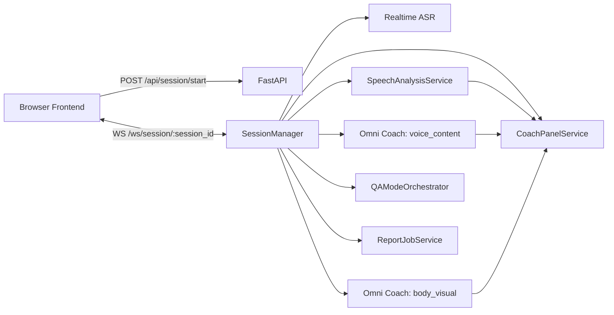

# Speak Up Realtime Architecture

这份文档只描述当前仓库已经落地的 realtime 架构。

## 1. 当前能力

- session 创建、查询、结束
- 浏览器到后端的 WebSocket realtime 通道
- `PCM 16k mono` 麦克风实时上行
- `qwen3-asr-flash-realtime` 实时转写
- `AI Live Coach` 三维 `coach_panel`
- QA interviewer 实时语音问答
- transcript timeline 回放
- 基于真实 `sessionId` 的报告生成
- 报告等待态安抚语音

## 2. 总体结构

## 3. 浏览器侧

### 音频

- `AudioWorklet` 采集麦克风
- 重采样到 `PCM 16k mono`
- 约 `100ms` 一包发送到后端

### 视频

- 浏览器截图而不是原始视频流推送
- 低频 JPEG 帧送给 Omni 视觉链路

### 训练模式

- `free_speech`
- `document_speech`

文档模式当前只影响训练页呈现和 QA 上下文，不直接进入实时打分。

## 4. 实时转写

Provider：

- 阿里云 `qwen3-asr-flash-realtime`

后端产出：

- `transcript_partial`
- `transcript_final`
- `speech_started / speech_stopped`

当前句子边界主要信任 provider VAD，后端只保留少量尾部语气词合并逻辑。

## 5. AI Live Coach

`AI Live Coach` 统一走 `coach_panel`，不再维护旧的滚动 insight feed。

三张卡固定为：

- `body_expression`
- `voice_pacing`
- `content_expression`

输入来源：

- `speech-rule`
- `omni-coach`

其中：

- `voice_content` lane 更新语音与内容
- `body_visual` lane 更新肢体与表情

## 6. QA 问答

后端核心：

- [session_manager.py](/Users/bytedance/my_project/speak_up/backend/app/services/session_manager.py)
- [qa_mode_orchestrator.py](/Users/bytedance/my_project/speak_up/backend/app/services/qa_mode_orchestrator.py)
- [qa_omni_realtime_service.py](/Users/bytedance/my_project/speak_up/backend/app/services/qa_omni_realtime_service.py)

当前规则：

- assistant 音频播完后才正式打开用户回答窗口
- `speech_stopped` 后会进入 `QA_AUTO_ADVANCE_DELAY_MS`
- 长时间没有有效回答会进入 `QA_SILENCE_FALLBACK_DELAY_MS`

### prewarm

QA prewarm 是后台 sidecar：

- 由单独 task 周期性触发
- 不在主问答推进链路里同步等待
- 但仍共享同一个进程、状态和上游模型资源

所以它是控制流旁路，不是硬隔离 lane。

## 7. 报告

报告已经不再是原型接口，当前链路由 [report_job_service.py](/Users/bytedance/my_project/speak_up/backend/app/services/report_job_service.py) 负责。

训练中会持续沉淀：

- transcript
- QA 问题文本
- coach 信号
- panel snapshot

并按固定周期离线构建 `window pack`。

点击生成报告时：

1. 先补齐已可构建窗口
2. 读取已有 `window pack`
3. 再补最后未覆盖尾窗
4. 一次性生成完整报告

当前报告数据已经落盘到 `output/report_data/<session_id>/`，不是纯内存态。

## 8. 安抚语音

报告页进入 processing 后，会并行触发安抚语音：

- `POST /api/session/{session_id}/report/reassurance-audio`

规则：

- 立即允许安抚
- 报告 ready 后淡出停止
- 最多播 3 次，不无限循环

## 9. Replay

当前 replay 主要保证 transcript timeline 可用：

- `GET /api/session/{session_id}/replay`

`mediaUrl / mediaType` 仍然为空，真实媒体回放还没接。

## 10. 当前工程边界

- 实时链路和报告链路都跑在同一个后端进程里
- 报告存储是本地文件，不是数据库
- QA prewarm 是软旁路，不是独立 worker
- 真实媒体回放仍未接入

### 1. ASR 和 Live Coach 分离

- 字幕链路只负责转写
- Live Coach 只负责 coach panel

不要让一条链路同时承担两种职责。

### 2. body_expression 和 voice/content 分离

- `body_expression` 需要独立视觉触发
- `voice/content` 用 partial 字幕先做轻量预览，再由 final 字幕和 Omni VAD 结果修正

### 3. 文档模式先做展示，再做理解

当前仓库已经按这个边界实现：

- 第一版：前端预览
- 第二版：报告阶段再用文档

## 当前涉及的核心文件

### 前端

- [src/hooks/useMockSession.ts](/Users/bytedance/my_project/speak_up/src/hooks/useMockSession.ts)
- [src/components/session/session-workspace.tsx](/Users/bytedance/my_project/speak_up/src/components/session/session-workspace.tsx)
- [src/components/session/live-analysis-panel.tsx](/Users/bytedance/my_project/speak_up/src/components/session/live-analysis-panel.tsx)
- [src/components/session/document-stage.tsx](/Users/bytedance/my_project/speak_up/src/components/session/document-stage.tsx)

### 后端

- [backend/app/main.py](/Users/bytedance/my_project/speak_up/backend/app/main.py)
- [backend/app/services/session_manager.py](/Users/bytedance/my_project/speak_up/backend/app/services/session_manager.py)
- [backend/app/services/stt_service.py](/Users/bytedance/my_project/speak_up/backend/app/services/stt_service.py)
- [backend/app/services/omni_service.py](/Users/bytedance/my_project/speak_up/backend/app/services/omni_service.py)
- [backend/app/services/speech_analysis_service.py](/Users/bytedance/my_project/speak_up/backend/app/services/speech_analysis_service.py)
- [backend/app/services/coach_panel_service.py](/Users/bytedance/my_project/speak_up/backend/app/services/coach_panel_service.py)
