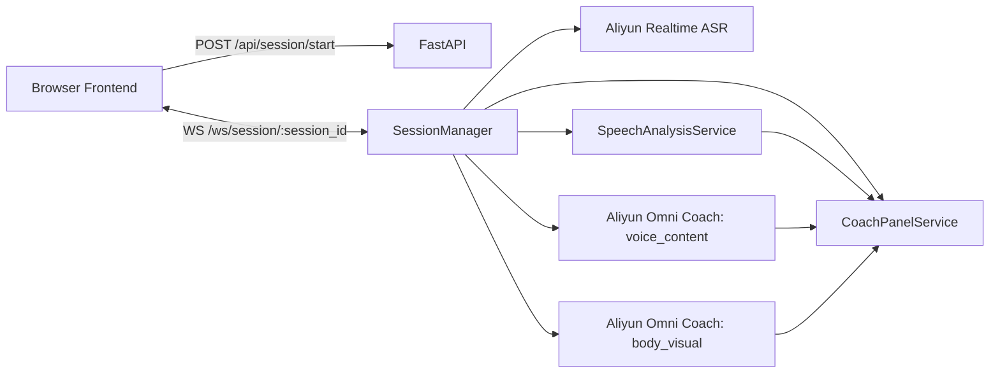

# Speak Up Realtime Architecture

## 目标

这份文档只描述当前仓库里真实在跑的 realtime 架构，不再保留早期排障方案或废弃链路。

当前重点是三件事：

- 实时转写
- 实时 AI Live Coach
- 训练结束后的报告与回放入口

## 当前实现状态

### 已落地

- session 创建、查询、结束
- 浏览器到后端的 WebSocket realtime 通道
- 麦克风 `PCM 16k mono` 实时上行
- 阿里云 `qwen3-asr-flash-realtime`
- 实时 `transcript_partial` / `transcript_final`
- 阿里云 `Qwen3.5-Omni-Realtime` 驱动的 `AI Live Coach`
- 固定三维 `coach_panel`
- transcript timeline 回放入口

### 仍然是原型实现

- `GET /api/report`
- `GET /api/history`
- 真实媒体回放
- 数据持久化
- 语音播报

## 当前总架构



## 浏览器侧

### 音频

- `AudioWorklet` 采集麦克风
- 重采样到 `PCM 16k mono`
- 约 `100ms` 一包发送

消息格式：

```json
{
  "type": "audio_chunk",
  "timestamp_ms": 1710000000000,
  "payload": "<base64 pcm bytes>",
  "mime_type": "audio/pcm",
  "sample_rate_hz": 16000,
  "channels": 1
}
```

### 视频

- 浏览器截图而不是原始视频流推送
- 当前约 `1s` 一张 JPEG
- 主用途是给 Omni 做低频视觉输入

### 训练模式

- `free_speech`
- `document_speech`

当前文档模式只改前端视图：

- 主区域显示文档
- 右上角显示摄像头小窗
- 文档内容暂不进入实时评分

## 后端 session 编排

所有 realtime fanout 都由 [session_manager.py](/Users/bytedance/my_project/speak_up/backend/app/services/session_manager.py) 负责。

### start_session

- `POST /api/session/start`
- 只创建 session，不启动 provider

### connect websocket

- `WS /ws/session/{session_id}`
- 建连后先推：
  - `session_status`
  - `coach_panel`

### start_stream

浏览器发 `start_stream` 后，后端并行启动三条链路：

1. `stt_service`
2. `omni_coach_service`，scope=`voice_content`
3. `omni_body_service`，scope=`body_visual`

## 实时转写链路

### Provider

- 阿里云 `qwen3-asr-flash-realtime`

### 输入

- 浏览器 `audio_chunk`

### 输出

后端映射成：

- `transcript_partial`
- `transcript_final`
- `error`

### 句子边界

主要信任 provider 的 `server_vad`。

后端只保留一条窄规则：

- 如果新 final 只是 `嗯 / 哦 / 诶` 这类尾部语气词，就并回上一句，不单独起一条 transcript

## AI Live Coach 链路

当前 `AI Live Coach` 不再走滚动 insight feed，而是走统一的 `coach_panel`。

### lane 1: voice_content

输入：

- 持续音频
- 持续视频帧

职责：

- 更新 `voice_pacing`
- 更新 `content_expression`

触发方式：

- `server_vad`

### lane 2: body_visual

输入：

- 持续视频帧
- 同会话附近音频作为上下文

职责：

- 更新 `body_expression`

触发方式：

- manual visual refresh
- 当前默认约 `1500ms` 一次

这样做的原因是：

- `body_expression` 不该依赖用户先说话
- 即使用户暂时不说话，明显的挡脸、偏头、托腮、离镜，也应该能更新

## Coach Panel 聚合

[coach_panel_service.py](/Users/bytedance/my_project/speak_up/backend/app/services/coach_panel_service.py) 统一维护三维状态：

- `body_expression`
- `voice_pacing`
- `content_expression`

### 输入来源

- `speech-rule`
- `omni-coach`

### 输出事件

- `coach_panel`

前端只消费这一个统一状态，不再直接消费 provider 原始输出。

## 前端 UI 形态

### Live Transcript

- 只展示转写时间轴

### AI Live Coach

- 顶部：当前重点
- 下方：三张固定维度卡

三维卡当前是：

- `肢体 & 表情`
- `语音语调 & 节奏`
- `内容 & 表达`

## Replay

当前 replay 只保证 transcript timeline 可用：

- `GET /api/session/{session_id}/replay`

当前返回：

- `sessionId`
- `scenarioId`
- `language`
- `transcript`

`mediaUrl` 和 `mediaType` 当前固定为 `null`。

## 报告

当前报告还是原型数据：

- `GET /api/report`

下一步合理方向不是先改页面壳子，而是改成按真实 `sessionId` 生成：

- transcript 证据
- coach panel 轨迹
- 回放跳转点
- 文档模式下的材料贴合度

## 文档模式下一步

当前文档模式只做演讲辅助，不做实时理解。

推荐后续顺序：

1. 保持实时阶段不接文档
2. 在报告阶段把文档作为 reference brief 输入模型
3. 评估：
   - 主线贴合度
   - 关键点覆盖
   - 结构执行度
   - 脱稿自然度

## 当前最重要的工程边界

### 1. ASR 和 Live Coach 分离

- 字幕链路只负责转写
- Live Coach 只负责 coach panel

不要让一条链路同时承担两种职责。

### 2. body_expression 和 voice/content 分离

- `body_expression` 需要独立视觉触发
- `voice/content` 适合按语音段触发

### 3. 文档模式先做展示，再做理解

当前仓库已经按这个边界实现：

- 第一版：前端预览
- 第二版：报告阶段再用文档

## 当前涉及的核心文件

### 前端

- [src/hooks/useMockSession.ts](/Users/bytedance/my_project/speak_up/src/hooks/useMockSession.ts)
- [src/components/session/session-workspace.tsx](/Users/bytedance/my_project/speak_up/src/components/session/session-workspace.tsx)
- [src/components/session/live-analysis-panel.tsx](/Users/bytedance/my_project/speak_up/src/components/session/live-analysis-panel.tsx)
- [src/components/session/document-stage.tsx](/Users/bytedance/my_project/speak_up/src/components/session/document-stage.tsx)

### 后端

- [backend/app/main.py](/Users/bytedance/my_project/speak_up/backend/app/main.py)
- [backend/app/services/session_manager.py](/Users/bytedance/my_project/speak_up/backend/app/services/session_manager.py)
- [backend/app/services/stt_service.py](/Users/bytedance/my_project/speak_up/backend/app/services/stt_service.py)
- [backend/app/services/omni_service.py](/Users/bytedance/my_project/speak_up/backend/app/services/omni_service.py)
- [backend/app/services/speech_analysis_service.py](/Users/bytedance/my_project/speak_up/backend/app/services/speech_analysis_service.py)
- [backend/app/services/coach_panel_service.py](/Users/bytedance/my_project/speak_up/backend/app/services/coach_panel_service.py)
